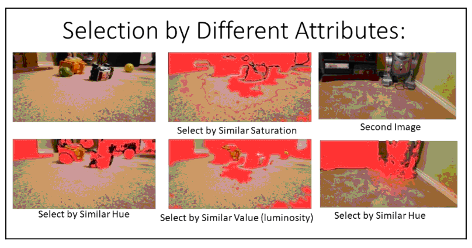
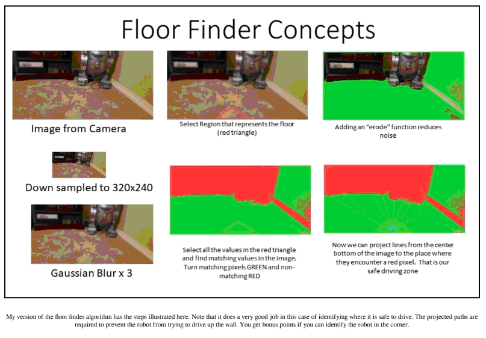
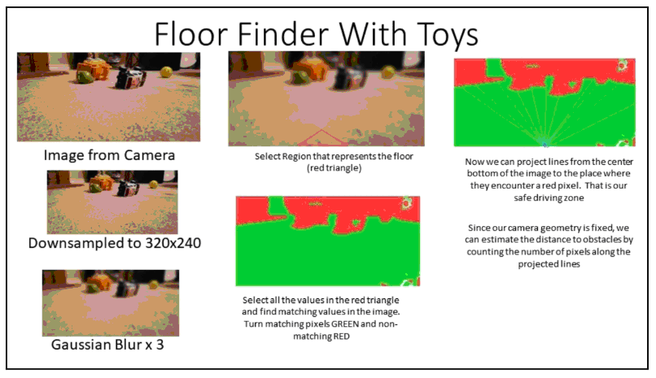
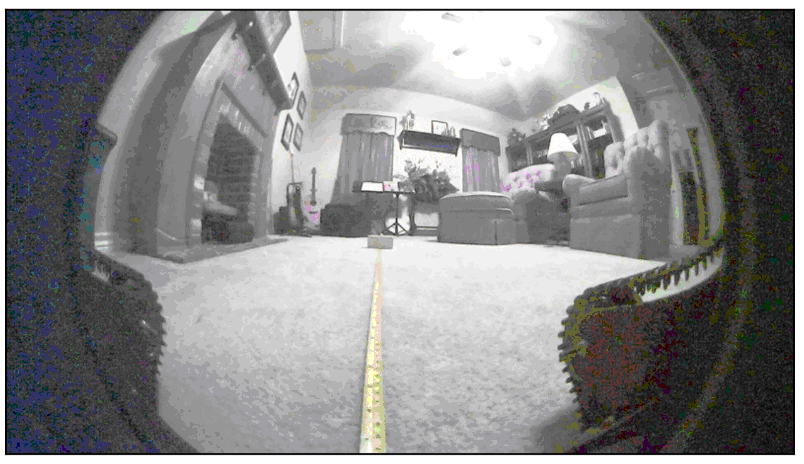

# Альтернативная навигация

Можно попробовать выполнить процесс под названием «Structure from Motion» \(построение структуры по движению\), чтобы получить информацию о глубине изображения с помощью нашей единственной камеры и использовать ее для составления карты. Для использования Structure from Motion требуется много текстур и краев, которых в помещении может и не быть. Кроме того, алгоритм оставляет много пустот, которые требуют заполнения и которых на карте не должно быть. Structure from Motion использует смещение в видеоизображениях для измерения расстояния до объекта, находящегося в поле зрения камеры. На базе этого алгоритма уже существует множество хороших исследований, некоторые из которых дают многообещающие результаты. Однако в видеоизображении должно быть много деталей, чтобы в процессе можно было сопоставлять точки одного кадра с другим.

Для ознакомления с различными подходами к Structure from Motion, можно ознакомиться со следующей статьей: [https://pdfs.semanticscholar.org/2ec3/32a1d0e73101eaecb0e066961a5e048464a1.pdf](https://pdfs.semanticscholar.org/2ec3/32a1d0e73101eaecb0e066961a5e048464a1.pdf)

Конечно, в нашем задании можно было бы просто кататься по комнате, ища игрушки наугад. Находя игрушку, робот поднимал бы ее, а затем беспорядочно ездил вокруг в поисках коробки с игрушками. Но при этом подходе нам все еще требуется алгоритм, чтобы избежать столкновения с препятствиями.

В другом варианте мы могли бы направить камеру на потолок и использовать ориентиры на потолке, чтобы определить наше местоположение. Но потолок в основном плоский и имеет лишь несколько ориентиров – потолочный вентилятор и коробку с киноэкраном внутри. Но он располагается достаточно далеко, что осложняет получение хорошего обзора, и не решает проблемы с препятствиями на пути.

Возможно, вы никогда не слышали о методе поиска пола \(floor finding\), который используется в некоторых других роботах, а также беспилотных автомобилях. Я узнал об этом методе во время DARPA Grand Challenge, в котором подобная технология была использована Stanley – машиной-победителем из Стэнфордского университета. Кроме того, много информации о поиске пола содержится в алгоритме, написанном Стивеном Гентнером в программном пакете RoboRealm, который является отличным инструментом для прототипирования систем зрения роботов. Вы можете найти его по адресу: [http://www.roborealm.com](http://www.roborealm.com).

В этой главе будет представлена другая версия техники поиска пола, которая отличается от RoboRealm или Stanley, но дает те же результаты.

Концепция довольно проста. Мы знаем, что пол непосредственно перед роботом свободен от препятствий. В качестве примера воспользуемся кадрами изображением области перед роботом и поищем текстуру, которая будет повторяться дальше. Сопоставим текстуру той части изображения, которая соответствует полу, с более удаленными пикселями. Если текстуры отображаются, мы помечаем эту область зеленым цветом, чтобы показать, что она свободна от препятствий и по ней можно двигаться. Фрагментами этого алгоритма мы и воспользуемся в данном разделе. Кстати, вы заметили, что я сказал текстура, а не цвет? В алгоритме цвет не соотносится с полом, поскольку поверхность пола неоднородна по цвету. К примеру, ковер или деревянный пол никогда не будут однородны по цвету, поэтому простой подбора цвета не сможет сопоставить пиксели в единое целое. Поэтому и следует опираться на структуру, которая описывается цветом, интенсивностью \(яркостью\), оттенками и шероховатостью текстуры \(мерой того, насколько гладкая поверхность\).

Попробуем провести несколько быстрых экспериментов с изображением пола в нашей игровой комнате. Начнем с изображения, которое мы получаем с камеры. Чтобы ускорить обработку и максимально эффективно использовать полосу пропускания, установим собственное разрешение камеры с максимального разрешения 1900x1200 до всего лишь 320x240. Перенесем это в нашу программу обработки изображений, используя OpenCV. Первый шаг – это размытие изображения с помощью функции размытия по Гауссу. Размытие по Гауссу использует параболическую функцию для уменьшения количества высокочастотной информации в изображении – это делает картинку более размытой, уменьшая различия между соседними пикселями. Чтобы получить достаточное размытие, мне пришлось применить функцию размытия три раза с ядром свертки 5х5 \(ядра свертки уже обсуждались в главе о нейронных сетях\). Это сглаживание делает цвета более однородными, что облегчает последующие шаги.

Обозначаем область перед роботом как область с четким обзором пола. Я использовал треугольную область, но квадратная тоже сработает. Выберем каждый из цветов, найденных в треугольнике, и захватим все пиксели, которые имели значение с 15 единицами этого цвета. Что значит 15 единиц? Каждый цвет кодируется со значением RGB от 0 до 255. Коричневый цвет ковра составляет около 162, 127, 22 в красных, зеленых и синих единицах измерения. Мы выбираем все цвета, которые находятся в пределах 15 единиц этого цвета, что для красного цвета составляет от 147 до 177. При этом выбираются участки изображения, похожие по цвету на наш пол. Наша стена очень похожа на коричневую или бежевую, но, к счастью, есть белый плинтус, который мы можем изолировать, чтобы робот не пытался забраться на стены.

Цвет – это не единственный способ объединить пиксели на нашем полу. Можно также искать пиксели с одинаковым оттенком \(оттенок цвета, независимо от того, насколько он яркий или темный\), пиксели с одинаковой насыщенностью \(темнота или яркость цвета\) и цвета с одинаковым значением или яркостью \(что аналогично совпадению цветов в монохромном изображении или изображению в оттенках серого\).

Проиллюстрируем описанный принцип:

На этой диаграмме показаны возможности различных атрибутов выбора \(цвет, оттенок, насыщенность и яркость\) в качестве инструмента для выполнения метода поиска пола. Оттенок \(hue\), по-видимому, обеспечивает наилучшие результаты в этом тесте. Однако после проведения проверки с помощью второй картинки, становится понятно, что есть небольшая проблема – не происходит выделения плинтуса.

Выберем все пиксели, соответствующие цветам нашего пола, и окрасим их в зеленый цвет – или, если быть точнее, создадим маску в копии изображения, которая содержит все пиксели, которые мы хотим каким-либо образом обозначить. Например, используем число 10. Создадим пустой буфер размером с наше изображение и превратим все пиксели в этом буфере в 10, что станет полом на другом изображении.

Использование функции erode для замаскированных данных может помочь в этом моменте. В изображении могут быть битые пиксели или шумы, в которых один или два пикселя не соответствуют цветам ковра – скажем, есть место, где кто-то уронил печенье. Функция Erode уменьшает уровень детализации маски, выбирая небольшую область – например, 3x3, и устанавливая пиксель маски на 10 только в том случае, если все окружающие пиксели также равны 10. Это уменьшает границу маски на один пиксель и удаляет все мелкие крапинки или точки размером в один или два пикселя. Далее можно увидеть, как довольно успешно произошло изолирование области пола с помощью очень прочной маски, покрашенной в зеленый цвет. И учитывая, что теперь мы знаем, где находится пол, закрашиваем другие пиксели в нашей маске красным цветом или каким-либо числом, означающим, что двигаться туда небезопасно. Давайте использовать число 255:

Следующий шаг может потребовать некоторого размышления с вашей стороны. На нем потребуется определить области, безопасные для езды. В этом процессе есть две части, которые могут вызвать некоторые проблемы. У нас может появиться объект на полу, к примеру, игрушка с зелеными пикселями по обе стороны от него. Также может возникнуть углубление, в которое робот сможет въехать, но не сможет выехать. На предыдущей диаграмме можно увидеть, что алгоритм покрасил пиксели стены в зеленый цвет, так как они соответствуют коричневому цвету пола. На месте плинтуса расположена красная полоса «запрещающих» пикселей. Чтобы обнаружить два описанных случая, построим линии от месторасположения робота в стороны и идентифицируем первый красный пиксель, в который попадем. Это установит границу мест, в которые робот сможет проехать. Аналогичный результат можно получить, если двигаться не по сторонам, а снизу вверх до первого красного пикселя.

Повторим этот процесс еще раз, добавив несколько игрушек к изображению, чтобы быть уверенными, что получаем желаемый результат:

Похоже, работает. Теперь мы способны найти путь, чтобы двигаться дальше. Следует иметь в виду, что вид препятствий постоянно обновляется с помощью метода поиска пола.

Еще один трюк, который можно использовать, – это применение фиксированной геометрии камеры для оценки расстояния и размера. У нас есть зафиксированная в одном положении камера, располагающаяся на роботе на заданной высоте от пола, и, следовательно, расстояние вдоль пола можно измерить по значению «у» у пикселей. Потребуется тщательно откалибровать камеру, чтобы сопоставить значения пикселей с расстоянием вдоль линии пути, которую мы провели от основания робота до препятствий. Расстояния будут нелинейными и действительными только для того расстояния, на котором пиксели продолжают изменяться.

Поскольку камера перпендикулярна полу, мы получаем небольшой эффект перспективы, который уменьшается до нуля примерно в 20 футах от камеры. Моя калибровка привела к следующей таблице:

В таблице показан алгоритм измерения расстояния в поле зрения камеры робота. Объект расположен в четырех футах от основания робота вдоль измерительной ленты. Обратим внимание, что робот легко видит свои собственные гусеницы на переднем плане. TinMan использует 180-градусный объектив fisheye на веб-камере с поддержкой HD.

Единственное, чего нужно остерегаться, – это узких проходов, в которые робот не поместится. Можно оценить ширину, опираясь на расстояния и пиксели. Один из методов, используемых ROS, заключается в том, чтобы поставить границу вокруг всех препятствий, равную 1/2 ширины робота. Если есть препятствия с обеих сторон, то две границы встретятся, и робот будет знать, что он не проходит.

