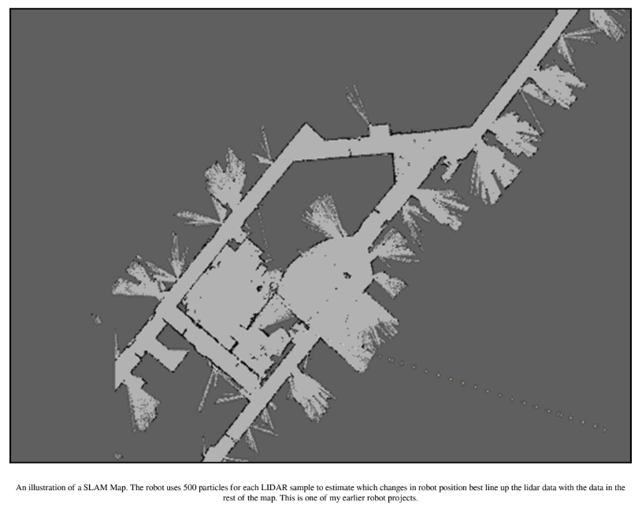

# Что такое SLAM?

SLAM – это распространенная методика для навигации роботов внутри помещений. Первая проблема движения робота в замкнутом помещении заключается в том, что у него нет карты. Вторая проблема – нет системы отсчета, чтобы найти себя, так как GPS не работает в помещении. Из этого следуют две задачи: требуется карта, а затем способ найти себя на этой карте. Хотя SLAM и начинается с буквы «S», что означает «одновременно», по правде говоря, большинство роботов составляют карту, сохраняют ее, а потом уже перемещаются по ней.

Как работает SLAM? Обычно с SLAM ассоциируется датчик – вращающийся LIDAR. Его можно представить как лазерный радар, который используется для измерения расстояния до объектов и вращается по кругу, чтобы собрать данные вокруг робота. Существует очень маленький LIDAR, называемый Rplidar, который стоит около $100,00 и используется для создания карт. Кроме того, есть отличный ROS package – Hector Mapping, позволяющий упростить использование LIDARа. Во время знакомства с этой главой Вы сможете заметить, что SLAM не является надежным процессом, и потребуется несколько раз пройтись по карте, чтобы она приняла достойный вид. Как только карта будет создана, следует постоянно обновлять ее, если что-то в комнате меняется \(например, внуки повсюду оставляют игрушки\).

Процесс SLAM на самом деле очень интересен, но не в той части, где происходит отдельное сканирование, а там, как сканы сшиваются вместе. 

\(Есть отличное видео, которое авторы Hector SLAM сняли в Hector SLAM в University Of Darmstadt, Germany, доступное по адресу: [https://www.youtube.com/watch?v=F8pdObV\_df4list=PL0E462904E5D35E29](https://www.youtube.com/watch?v=F8pdObV_df4list=PL0E462904E5D35E29) – Handheld Mapping in the Robocup 2011 Rescue Arena\).

В процессе SLAM в первую очередь измеряется расстояние от робота до всех объектов в комнате. Затем робот перемещается на некоторое расстояние – например, на три дюйма вперед. Затем снова происходит измерение расстояний. Теперь остается лишь придумать преобразование, которое преобразует данные со второй развертки в соответствии с данными из первой развертки. Для этого в двух метках должна быть информация, которую можно соотнести – углы, дверные проемы, края, мебель. По этой причине SLAM может быть трудно, а иногда и невозможно работать в длинных пустых коридорах, поскольку у него просто нет информации для работы – одна развертка LIDARа выглядит точно так же, как и следующая. Чтобы помочь решить эту проблему, многие системы SLAM требуют добавления к роботу других датчиков, которые измеряют одометрию колес или используют оптический поток для измерения движения, чтобы предоставить дополнительные данные для оценки положения:

Итог по SLAM можно подвести следующим образом: робот производит измерение помещения, проводя лазерным дальномером вокруг оси. Возвращаемые данные представляют собой список измерений расстояния, где угловая мера является функцией ее положения в списке, то есть, если есть список из 360 измерений в круге, то первое число в нашем списке – 0 градусов, следующее – 1 градус и так далее. Можно извлекать объекты из данных LIDARа путем поиска углов, ребер, скачков и разрывов. Далее по углу и расстоянию до каждого объекта из последующих измерений создается функция, которая дает наилучшую оценку того, насколько сильно изменилось положение робота. Эта информация используется для преобразования данных LIDARа из сенсорно-центрической системы координат в некую комнатную систему координат, предполагающую, что начальное положение робота равно координате 0,0. Такое математическое преобразование и будет представлять собой комбинацию перемещения \(движения\) и вращения корпуса робота.

Одним из способов оценки этого преобразования является использование частиц. В этом способе создаются выборки пространства движения робота в каждой из точек, в которую робот мог бы переместиться, и случайным образом размещаются новые точки вдоль всех остальных. Вычисляется преобразование для каждой из этих выборок, а затем проверяется, какая выборка лучше всего соответствует собранным данным. Этот процесс называется фильтром частиц.

После быстрого знакомства со SLAM хочется обсудить, почему мы не будем использовать его в дальнейшем. SLAM – важная тема, широко использующая для навигации, но это не единственный способ решить задачу нашей главы.

К слабым сторонам SLAM в нашем задании можно отнести:

* Потребность в таком датчике, как LIDAR, который является дорогостоящим, механически сложным и генерирует много данных. В наших же планах робот должен быть дешевым, надежным и простым. 
* SLAM работает лучше, если колеса робота имеют одометрию, которая не работает на гусеницах, как у нашего TinMan. Гусеничные роботы также могут быть названы трудно управляемыми транспортными средствами, потому что гусеницы скользят по поверхности и двигаются без поворота, что делает невозможной любую одометрию колес, которая предполагает, что колеса всегда вращаются в контакте с поверхностью. 
* SLAM не имеет дела с изменяющимся планом пола. TinMan будет взаимодействовать с игрушками, лежащими по комнате, которые будут мешать LIDARу и менять план пола, который SLAM использует для оценки положения. Робот также меняет план пола, когда он подбирает игрушки и убирает их. 
* У SLAM возникают проблемы, если данные неоднозначны или если у робота недостаточно возможностей для оценки изменений, например в коридорах или симметричных комнатах.

