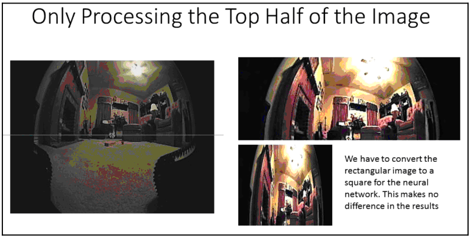

# Нейронные сети

Нейронные сети мы будем использовать для классификации изображений с камеры. Используя камеру, которая делает четыре снимка в секунду, мы записываем действия робота на каждом изображении: движение вперед, поворот направо, поворот налево или отступ назад. По этой информации будет предсказываться траектория движения робота с учетом изображения. Мы создаем сверточную нейронную сеть \(convolutional neural network или CNN\), с изображением камеры в качестве входных данных и четырьмя типами выходных данных – движение вперед, влево, вправо и назад. Благодаря этому методу, мы автоматически станем избегать препятствий и опасностей. Когда робот доберется до лестницы \(вспомним, что есть лестница, идущая вниз, которая может повредить роботу\), он будет знать, что следует повернуть назад, потому что он обучился этому на тренировке. Таким образом, робот учится ориентироваться в комнате на собственном примере.

Нейросетевой подход позволит нам передвигаться по комнате, избегать опасностей и мебели, но не поможет роботу избежать игрушек, которых нет в учебной выборке. Мы не можем поместить их в эту выборку, потому что игрушки никогда не находятся в одном и том же месте дважды. Вспомним, что собираемся использовать алгоритма поиска пола, чтобы помочь избежать игрушек. Как же совместить эти два понятия? Нейронная сеть обеспечивает роботу более дальнюю цель, а алгоритм поиска пола модифицирует эту цель, чтобы избежать локальных объектов ближнего радиуса действия. В нашей программе мы сначала делаем оценку с помощью нейросети, а затем ищем пол, чтобы выбрать четкий маршрут.

В этой теме используем еще один трюк для обучения робота. Поскольку поверхность пола подвержена изменениям и может быть покрыта игрушками, составим эту часть из обучающих изображений. Прежде чем отправить изображение в нейронную сеть, мы будем разрезать его пополам и использовать только верхнюю половину изображения.

Поскольку камера зафиксирована и находится на одном уровне с полом, для навигации можно использовать только верхнюю половину изображения. Картинка имеет широкий угол обзора в 180 градусов, поэтому у нас будет много информации для работы. Это должно дать нам устойчивость для навигации в любых условиях:

Следующая проблема – местонахождение коробки с игрушками. Для решения создаем новую обучающую выборку. Мы запускаем робота в различных случайных местах, а затем просто едем к коробке с игрушками. Мы используем точно такой же процесс, который использовали раньше для навигации – создаем обучающую выборку, которая объясняет роботу, как добраться до коробки с игрушками. Хитрость заключается в том, чтобы получить хороший образец каждого возможного начального местоположения. Есть небольшое преимущество – если точка уже находится на одном пути, нам не нужно снова ее покрывать. Другими словами, все точки, включенные в другой путь, не должны повторяться. Для обучения потребуется по крайней мере 1000 изображений из обеих выборок – той, которая исследует комнату, и той, которая ведет к коробке с игрушками.

Я написал простую программу, которая позволяет оператору управлять роботом с помощью джойстика и делает снимок каждую секунду. Каждый кадр помечается значением cmd\_vel. Если угловая скорость по оси Z \(angular.z\) положительна, мы поворачиваем направо. Если она отрицательна, то мы поворачиваем налево, а если значение равно нулю, то робот двигается вперед. Я создал независимую программу, которая работает с камерой и сохраняет снимок каждый раз, когда она получает команду TAKE PIC LEFT/RIGHT/CENTER в Ros syscommand. Обе эти программы будут размещены на сайте GitHub для книги – в этом отрывке они не включены по причине экономии места.

Можно представить, что нейронная сеть работает следующим образом: мы предоставляем нейронной сети изображение. Нейронная сеть выбирает объекты на картинке, а затем выбирает изображения, которые больше всего похожи на объекты с предоставленной нами картинки. Она берет соответствующие метки из этих обучающих изображений и производит ряд возможных выходных данных – право, лево, прямо – которые соответствуют большинству объектов.

